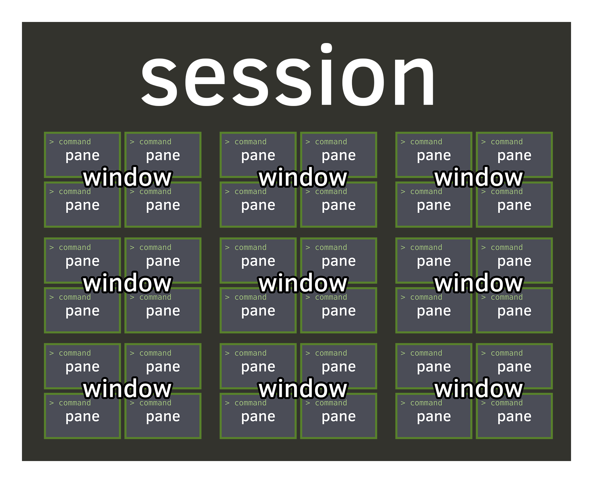
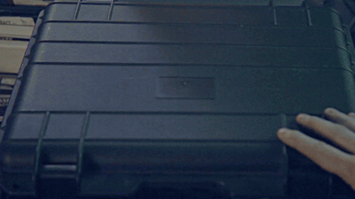

# `tmux`


---

Welcome young padawans!

----

### What is `tmux`

----

### `tmux` is a terminal multiplexer!

----


----

### `tmux` is a server and client running in your terminal

----


----

### `tmux` is a windows / tab manager for your terminal, allowing you to multitask (!)

----


Ok, a bit saner.

---

### Let's run it shall we?

```sh
tmux
```

----

### What do we have here?

Looks like a regular shell with some kind of weird green footer.

----

### You're staring at a `tmux` pane.

A pane is a running command (a shell is a running command).

A pane lives in a window, like a browser tab.

A window lives in a session, like a browser window.

----



----


----

We'll get back to that, let's run thingz!!1

```sh
echo "I SEE DREAD PEOPLE"
```

----

Ok. We ran `echo`, how exciting.

----

### CLOSE THAT TERMINAL NOW!!!

----

Reopen the terminal, and run the following:

```sh
tmux attach
```

----


*MAGIC*

----

### What the duck happened here?

When we first ran `tmux`, it created a server that continues in the background.

So when we reopened our terminal, we get right back to where we were when we closed the terminal.

----


Kewl right?!?!?!!1

---

### Let's do something useful.

In your browser, you can open several windows, each with several tabs, let's try that here.

----

### Run the following (notice the left bottom corner)

```sh
tmux rename-session tmuxalicous
tmux detach
```

----

### What? Where did our green footer of joy go to???


```sh
tmux ls
tmux attach -t tmuxalicous
```

----

### AMAZONG

Now prepare to have your minds blown away...

----

### Tabs, Splits and Oh My

```sh
tmux split-window
```

Holy Moses!!1

```sh
tmux rename-window foo
tmux new-window -n bar
```

I CAN HAZ TABZ!!1

```sh
tmux list-windows
tmux select-window -t foo
```

----


---

### All this writing is annoying, Y U NO KEYBINDINGZ?



Beeing geekalicious, `tmux` has kick ass keybindings.

----

### It all starts with the magic **MODIFIER/prefix** key combination

In order to send commands to `tmux`, we need to signal that the input is designated for `tmux`.

To do so, we use a specific prefix (also called modifier) that `tmux` can identify, which by default is set to `Ctrl + B`.

----

_Keyboard shorctut examples will be written as:_

`Modifier, KEY`

Which means `Ctrl + B, then, KEY`

----

### Let's try that out

Press `Modifier, "`

Yaay! A new split!

----

There are loads and loads of keyboard shortcuts for `tmux`, which of course you can modify.

Here's a [link](https://leanpub.com/the-tao-of-tmux/read#appendix-cheatsheets) to a kick ass cheatsheet, both for keyboard shortcuts and commands.

---

### Let's run a command with LOTZ of output

```sh
ps aux
```

Oh my, that was long, I wish we could search that...........

----

### Enter copy mode

----

If we now press `prefix, [`, we enter copy mode.

Here we can search up with arrows / FN keys.

----

# Vi copypaste mode

```sh
tmux set -g mode-keys vi
tmux set -g status-keys vi
```

----

This allows us to search the `ps aux` window very similar to `less` pager.

---

### Navigating around

----

### To Move between:

Splits, use `Modifier, ARROW-KEY`.

Windows: `Modifier, n` or `Modifier, p`

Explicit window: `Modifier, #nr`.

Sessions: `Modifier, s` then choose with arrows and enter.

---

# Appendix

----

There are numerous ways to automate session creation in tmux, the more popular ones are [tmuxp](http://tmuxp.readthedocs.io) and [tmuxinator](https://github.com/tmuxinator/tmuxinator).

Both do roughly the same thing, you can define your sessions beforehand using YAML or JSON files.

----

E.g

```yaml
---
session_name: my-project
start_directory: $WORKSOURCEDIR/my-project
shell_command_before: . ./.venv/bin/activate
windows:
- panes:
  - vim
  window_name: editor
- layout: even-vertical
  panes:
  - ipython
  - py.test -f
  window_name: shellAndTests
- panes:
  - git status
  window_name: git
```

----

# Good practices

Save your own `~/.tmux.conf` with sane defaults.

The cool kids also have a remote tmux.conf to be able to have **TMUX INCEPTION** when ssh'ing to other machines.


----

### MOAR Materials

http://tmuxp.readthedocs.io/en/latest/about_tmux.html

https://leanpub.com/the-tao-of-tmux/read

https://github.com/gpakosz/.tmux

https://blog.birkhoff.me/make-sudo-authenticate-with-touch-id-in-a-tmux/

As of tmux 2.1, you can enable mouse by adding it to your `.tmux.conf`: `set -g mouse on`

---

# FIN


